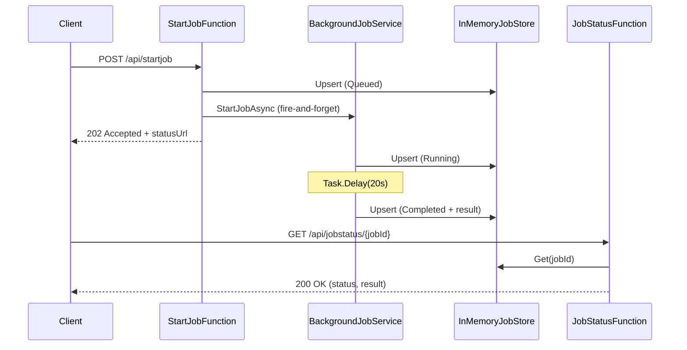

# asyncBack

A simple Azure Functions (isolated worker) backend that demonstrates asynchronous/background job processing with polling.

## What this project does

This API exposes two HTTP endpoints:

1. `POST /api/startjob`
- Creates a new job ID.
- Queues a background task.
- Returns `202 Accepted` and a status URL.

2. `GET /api/jobstatus/{jobId}`
- Reads the current job state.
- Returns `200 OK` with status/result if found.
- Returns `404 Not Found` if the job ID does not exist.

The background task simulates long-running work (20 seconds), then marks the job as completed.

## Project structure and purpose

### Root files

#### `asyncBack.csproj`

Project configuration for .NET + Azure Functions isolated worker. Defines the target framework (`net10.0`), Azure Functions version (`v4`), and package dependencies.

```xml
<Project Sdk="Microsoft.NET.Sdk">

  <PropertyGroup>
    <TargetFramework>net10.0</TargetFramework>
    <AzureFunctionsVersion>v4</AzureFunctionsVersion>
    <OutputType>Exe</OutputType>
    <ImplicitUsings>enable</ImplicitUsings>
    <Nullable>enable</Nullable>
  </PropertyGroup>

  <ItemGroup>
    <FrameworkReference Include="Microsoft.AspNetCore.App" />
    <PackageReference Include="Microsoft.ApplicationInsights.WorkerService" Version="2.23.0" />
    <PackageReference Include="Microsoft.Azure.Functions.Worker" Version="2.51.0" />
    <PackageReference Include="Microsoft.Azure.Functions.Worker.ApplicationInsights" Version="2.50.0" />
    <PackageReference Include="Microsoft.Azure.Functions.Worker.Extensions.Http.AspNetCore" Version="2.1.0" />
    <PackageReference Include="Microsoft.Azure.Functions.Worker.Sdk" Version="2.0.7" />
  </ItemGroup>

</Project>
```

#### `Program.cs`

Application startup/bootstrapping. Configures the Functions host + Application Insights, and registers dependency injection services so the functions can resolve `IJobStore` and `IBackgroundJobService`.

```csharp
using Microsoft.Azure.Functions.Worker;
using Microsoft.Azure.Functions.Worker.Builder;
using Microsoft.Extensions.DependencyInjection;
using Microsoft.Extensions.Hosting;
using asyncBack.Services;

var builder = FunctionsApplication.CreateBuilder(args);

builder.ConfigureFunctionsWebApplication();

builder.Services
    .AddApplicationInsightsTelemetryWorkerService()
    .ConfigureFunctionsApplicationInsights();

builder.Services.AddSingleton<IJobStore, InMemoryJobStore>();
builder.Services.AddSingleton<IBackgroundJobService, BackgroundJobService>();

builder.Build().Run();
```

#### `host.json`

Host-level Azure Functions runtime settings, including logging and Application Insights sampling.

```json
{
    "version": "2.0",
    "logging": {
        "applicationInsights": {
            "samplingSettings": {
                "isEnabled": true,
                "excludedTypes": "Request"
            },
            "enableLiveMetricsFilters": true
        }
    }
}
```

#### `local.settings.json`

Local-only runtime settings (not for production secrets). Sets storage and worker runtime for local development.

```json
{
    "IsEncrypted": false,
    "Values": {
        "AzureWebJobsStorage": "UseDevelopmentStorage=true",
        "FUNCTIONS_WORKER_RUNTIME": "dotnet-isolated"
    }
}
```

### `Functions/`

Contains HTTP-triggered Azure Functions (API endpoints).

#### `StartJobFunction.cs`

Handles `POST /api/startjob`. Creates a job record with `Queued` status, starts background processing using `Task.Run`, and returns the `jobId` and `statusUrl`.

```csharp
[Function("StartJob")]
public async Task<HttpResponseData> Run(
    [HttpTrigger(AuthorizationLevel.Function, "post", Route = "startjob")]
    HttpRequestData req)
{
    var jobId = Guid.NewGuid().ToString("N");

    jobStore.Upsert(new JobStatusModel
    {
        JobId = jobId,
        Status = "Queued"
    });

    _ = Task.Run(() => backgroundJobService.StartJobAsync(jobId));

    logger.LogInformation("Accepted job {JobId}", jobId);

    var response = req.CreateResponse(HttpStatusCode.Accepted);
    await response.WriteAsJsonAsync(new
    {
        jobId,
        status = "Accepted",
        statusUrl = $"/api/jobstatus/{jobId}"
    });

    return response;
}
```

#### `JobStatusFunction.cs`

Handles `GET /api/jobstatus/{jobId}`. Looks up the job in the store and returns the status payload (`jobId`, `status`, `result`) or a `NotFound` response.

```csharp
[Function("JobStatus")]
public async Task<HttpResponseData> Run(
    [HttpTrigger(AuthorizationLevel.Function, "get", Route = "jobstatus/{jobId}")]
    HttpRequestData req,
    string jobId)
{
    var job = jobStore.Get(jobId);

    if (job is null)
    {
        var notFound = req.CreateResponse(HttpStatusCode.NotFound);
        await notFound.WriteAsJsonAsync(new { jobId, status = "NotFound" });
        return notFound;
    }

    var ok = req.CreateResponse(HttpStatusCode.OK);
    await ok.WriteAsJsonAsync(new
    {
        jobId = job.JobId,
        status = job.Status,
        result = job.Result
    });

    return ok;
}
```

### `Services/`

Contains business logic and the storage abstraction.

#### `IBackgroundJobService.cs`

Interface for background job execution.

```csharp
namespace asyncBack.Services;

public interface IBackgroundJobService
{
    Task StartJobAsync(string jobId, CancellationToken cancellationToken = default);
}
```

#### `BackgroundJobService.cs`

Implements the job lifecycle (`Queued -> Running -> Completed`, or `-> Failed` on exception), simulates work with `Task.Delay(20s)`, and persists updates through `IJobStore`.

```csharp
public async Task StartJobAsync(string jobId, CancellationToken cancellationToken = default)
{
    var running = jobStore.Get(jobId) ?? new JobStatusModel { JobId = jobId };
    running.Status = "Running";
    running.Result = null;
    jobStore.Upsert(running);

    try
    {
        logger.LogInformation("Job {JobId} started", jobId);

        await Task.Delay(TimeSpan.FromSeconds(20), cancellationToken);

        var completed = jobStore.Get(jobId) ?? new JobStatusModel { JobId = jobId };
        completed.Status = "Completed";
        completed.Result = $"Finished at {DateTimeOffset.UtcNow:O}";
        jobStore.Upsert(completed);

        logger.LogInformation("Job {JobId} completed", jobId);
    }
    catch (Exception ex)
    {
        var failed = jobStore.Get(jobId) ?? new JobStatusModel { JobId = jobId };
        failed.Status = "Failed";
        failed.Result = ex.Message;
        jobStore.Upsert(failed);

        logger.LogError(ex, "Job {JobId} failed", jobId);
    }
}
```

#### `IJobStore.cs`

Interface for job persistence operations.

```csharp
using asyncBack.Models;

namespace asyncBack.Services;

public interface IJobStore
{
    JobStatusModel? Get(string jobId);
    void Upsert(JobStatusModel job);
    bool Exists(string jobId);
}
```

#### `InMemoryJobStore.cs`

In-memory implementation using `ConcurrentDictionary`. Good for demos/local development; data is lost when the app restarts.

```csharp
using System.Collections.Concurrent;
using asyncBack.Models;

namespace asyncBack.Services;

public class InMemoryJobStore : IJobStore
{
    private readonly ConcurrentDictionary<string, JobStatusModel> _jobs = new();

    public JobStatusModel? Get(string jobId)
        => _jobs.TryGetValue(jobId, out var job) ? job : null;

    public void Upsert(JobStatusModel job)
        => _jobs[job.JobId] = job;

    public bool Exists(string jobId)
        => _jobs.ContainsKey(jobId);
}
```

### `Models/`

Contains data models shared across functions/services.

#### `JobStatusModel.cs`

Represents a job state object with its ID, status, and optional result.

```csharp
namespace asyncBack.Models;

public class JobStatusModel
{
    public string JobId { get; set; } = string.Empty;
    public string Status { get; set; } = "Queued";
    public string? Result { get; set; }
}
```

### Build/runtime artifacts

- `bin/` — Compiled output and runtime artifacts.
- `obj/` — Intermediate build files generated by the .NET SDK.
- `Properties/launchSettings.json` — Local launch/debug profile settings.

## Request flow (high level)

1. Client calls `POST /api/startjob`.
2. API creates job with `Queued` status in `InMemoryJobStore`.
3. API immediately returns `202 Accepted` with `jobId` and status endpoint.
4. `BackgroundJobService` updates status to `Running`.
5. After simulated work, status becomes `Completed` and result is saved.
6. Client polls `GET /api/jobstatus/{jobId}` until done.



## Run locally

### Prerequisites

- .NET SDK installed
- Azure Functions Core Tools installed

### Commands

```bash
func start
```

Or:

```bash
dotnet build
func start
```

## Example usage

Start a job:

```bash
curl -X POST http://localhost:7071/api/startjob
```

Example response:

```json
{
  "jobId": "0f8fad5bd9cb469fa16570867728950e",
  "status": "Accepted",
  "statusUrl": "/api/jobstatus/0f8fad5bd9cb469fa16570867728950e"
}
```

Check status:

```bash
curl http://localhost:7071/api/jobstatus/0f8fad5bd9cb469fa16570867728950e
```

Example response:

```json
{
  "jobId": "0f8fad5bd9cb469fa16570867728950e",
  "status": "Completed",
  "result": "Finished at 2026-06-05T12:00:20.0000000+00:00"
}
```

Replace the job ID with the value returned by `startjob`.

### PowerShell

Start a job and check its status using PowerShell:

```powershell
$start = Invoke-RestMethod -Method Post -Uri http://localhost:7071/api/startjob
$start | ConvertTo-Json
Invoke-RestMethod -Uri "http://localhost:7071/api/jobstatus/$($start.jobId)" | ConvertTo-Json
```

## Notes for production

- Replace in-memory storage with durable persistence (SQL/Cosmos DB/Redis/etc.).
- Consider Durable Functions for robust orchestration.
- Add authentication/authorization to HTTP endpoints.
- Add retry policies and cancellation handling.
